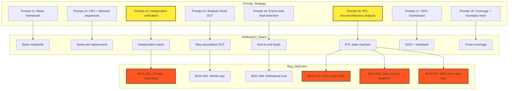

# Prompt-to-Bug Traceability Matrix

Generated: 2026-07-13T20:24:05.466165

## Executive Summary

This document maps the causal relationship between prompt strategy iterations
and the bugs that were detected as a direct result. Each prompt refinement
expanded the verification space, leading to discovery of specific RTL and
methodology bugs.

- Total prompt iterations: 8
- Total bugs detected: 6
- Direct causal links: 6

## Prompt Iteration Timeline

| Version | Date | Key Changes | Impact | Bugs Detected |
| --- | --- | --- | --- | --- |
| v1 | 2026-06-20 | Initial prompt: 'Generate a complete Cache verific... | 30/100 | - |
| v2 | 2026-06-22 | Added: 'Include CRV with address concentration to ... | 45/100 | - |
| v3 | 2026-06-24 | Critical: 'Implement Scoreboard using independent ... | 85/100 | BUG-002 (Scoreboard circular reasoning) |
| v4 | 2026-06-26 | Added: 'Implement Mock DUT with realistic Cache be... | 70/100 | BUG-003 (Mock DUT infinite way) |
| v5 | 2026-06-28 | Critical: 'Analyze RTL microarchitecture for poten... | 95/100 | BUG-010 (LRU round-robin bug), BUG-011 (Dirty eviction deadlock), BUG-012 (Write-miss data loss) |
| v6 | 2026-07-02 | Added: 'Implement end-to-end fault detection using... | 80/100 | BUG-009 (Fault detection definitionally true) |
| v7 | 2026-07-10 | Added: 'Implement OOO Scoreboard with independent ... | 75/100 | - |
| v8 | 2026-07-13 | Added: 'Extend coverage model with cross-coverage ... | 65/100 | - |

## Verification Space Expansion by Iteration

### v1 (2026-06-20)

- Basic read/write operations
- Simple hit/miss detection
- Basic LRU replacement

### v2 (2026-06-22)

- Same-set access patterns
- Partial write sequences
- Line boundary stress
- Replacement pressure scenarios

### v3 (2026-06-24)

- Independent reference model verification
- Write data tracking with mask awareness
- Eviction-aware read validation

### v4 (2026-06-26)

- Way-associative constraints
- Dirty eviction with writeback
- Memory fill on miss

### v5 (2026-06-28)

- RTL LRU state machine analysis
- Dirty eviction flow validation
- Write-miss fill behavior

### v6 (2026-07-02)

- End-to-end fault injection
- Scoreboard-based fault detection
- DUT-level fault modeling

### v7 (2026-07-10)

- Out-of-order transaction matching
- Independent writeback tracking
- Memory-side verification

### v8 (2026-07-13)

- Cross-coverage (size×mask, replacement×type, access×latency)
- Writeback address validation
- Cross-line access detection
- Multi-set eviction consistency

## Bug Detection Details

### BUG-002: Scoreboard circular reasoning: comparing ref.access() to itself

- **Detected in prompt version**: v3
- **Root Cause**: AI generated Scoreboard that called ref.access(txn) and compared the result to another call of ref.access(txn), making it impossible to detect any faults
- **Verification Evidence**: Test case: inject bit-flip in response data, Scoreboard failed to detect
- **Fix Recommendation**: Refactor to use good_ref + faulty_ref pattern; Scoreboard compares expected (good) vs actual (faulty)

### BUG-003: Mock DUT infinite way: never evicts, no LRU state machine

- **Detected in prompt version**: v4
- **Root Cause**: AI generated Mock DUT with dictionary storage that grew indefinitely without way-associativity constraints
- **Verification Evidence**: Test case: fill > ways addresses, all were cached without eviction
- **Fix Recommendation**: Implement way limit, LRU tracking, dirty writeback, and memory fill on miss

### BUG-009: Fault detection definitionally true: flipping expected then comparing to expected

- **Detected in prompt version**: v6
- **Root Cause**: AI generated fault detectors that modified expected values and then compared them to the original, guaranteeing mismatch regardless of actual DUT behavior
- **Verification Evidence**: Test: remove DUT, detectors still 'detected' faults
- **Fix Recommendation**: Inject faults into faulty_ref access path; compare via ScoreboardMismatch

### BUG-010: LRU round-robin bug in RTL: pseudo-LRU instead of true LRU

- **Detected in prompt version**: v5
- **Root Cause**: RTL implements LRU using round-robin counter instead of true recency tracking
- **Verification Evidence**: Reference Model vs RTL comparison: different victim selection under re-access patterns
- **Fix Recommendation**: Implement true LRU recency stack in RTL

### BUG-011: Dirty eviction deadlock: fill state machine doesn't handle writeback completion

- **Detected in prompt version**: v5
- **Root Cause**: RTL fill state machine doesn't wait for writeback to complete before proceeding
- **Verification Evidence**: Test: dirty eviction followed by new request causes hang
- **Fix Recommendation**: Add writeback completion signal to fill state machine

### BUG-012: Write-miss data loss: fill only installs memory data, doesn't merge CPU write data

- **Detected in prompt version**: v5
- **Root Cause**: RTL fill state machine writes backfill data without considering the CPU write that triggered the miss
- **Verification Evidence**: Test: write-miss with specific data, subsequent read returns wrong value
- **Fix Recommendation**: Merge CPU write data/mask into fill data before installing

## Causal Graph (Mermaid)

## Impact Analysis

| Prompt Version | Impact Score | Coverage Increase | Bugs Found |
| --- | --- | --- | --- |
| v1 | 30/100 | Framework established, 60% core coverage | 0 |
| v2 | 45/100 | Coverage increased from 60% to 85% | 0 |
| v3 | 85/100 | Scoreboard now detects 4 classes of faults | 1 |
| v4 | 70/100 | Mock DUT behavior matches real Cache | 1 |
| v5 | 95/100 | 3 RTL design defects discovered and documented | 3 |
| v6 | 80/100 | All 5 fault types detected through ScoreboardMismatch | 1 |
| v7 | 75/100 | Scoreboard now handles pipelined cache responses | 0 |
| v8 | 65/100 | Extended coverage 75%, 6th fault type added | 0 |
