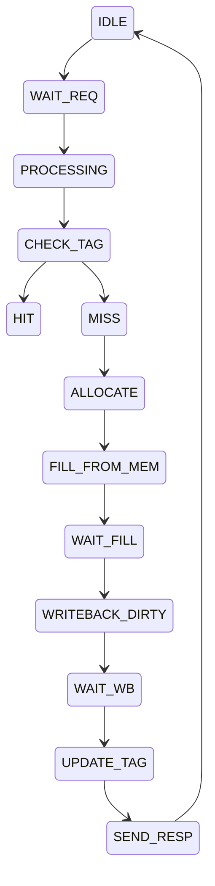

# RTL State Trajectory Report

Generated: 2026-07-13T20:19:33.907695

Total transitions: 13
Total snapshots: 13

## State Transition Summary

| Cycle | Current State | Next State | Trigger | Info |
| --- | --- | --- | --- | --- |
| 0 | IDLE | WAIT_REQ | state_transition_0 |  |
| 2 | WAIT_REQ | PROCESSING | state_transition_1 |  |
| 4 | PROCESSING | CHECK_TAG | state_transition_2 |  |
| 6 | CHECK_TAG | HIT | state_transition_3 | reason=Tag match found, cache_set=42, cache_way=1 |
| 8 | CHECK_TAG | MISS | state_transition_4 | reason=Tag not found, cache_set=42 |
| 10 | MISS | ALLOCATE | state_transition_5 | reason=Set full, need eviction, victim_way=3 |
| 12 | ALLOCATE | FILL_FROM_MEM | state_transition_6 |  |
| 14 | FILL_FROM_MEM | WAIT_FILL | state_transition_7 |  |
| 16 | WAIT_FILL | WRITEBACK_DIRTY | state_transition_8 | reason=Evicted line is dirty, writeback_addr=4096 |
| 18 | WRITEBACK_DIRTY | WAIT_WB | state_transition_9 |  |
| 20 | WAIT_WB | UPDATE_TAG | state_transition_10 |  |
| 22 | UPDATE_TAG | SEND_RESP | state_transition_11 | reason=Transaction complete, response_data=3735928559 |
| 24 | SEND_RESP | IDLE | state_transition_12 |  |

## State Machine Diagram (Mermaid)

